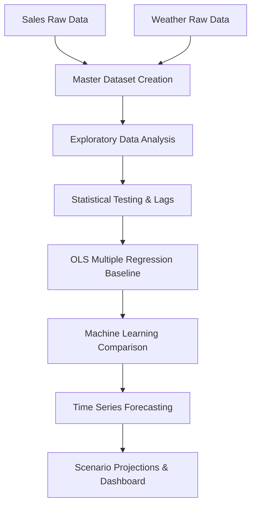
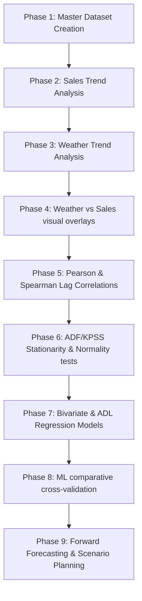
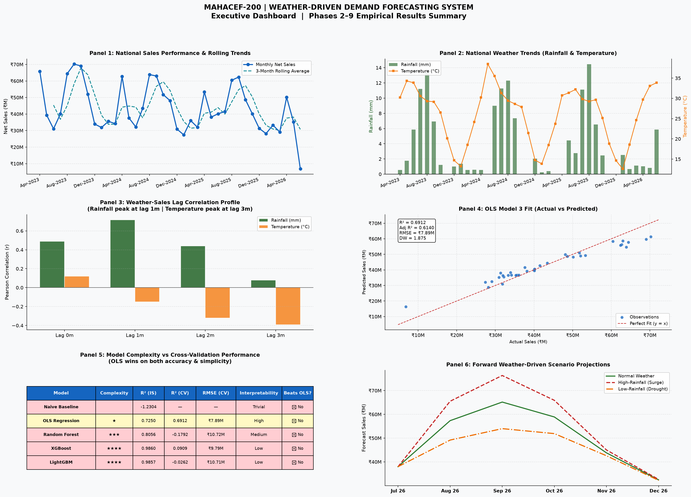
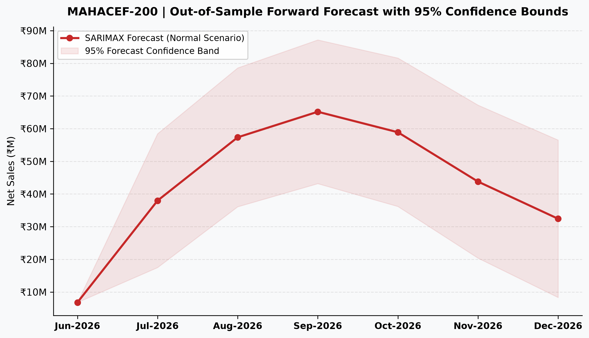

# Weather-Driven Pharmaceutical Sales Forecasting
## Statistical Analysis, Machine Learning and Time-Series Forecasting for MAHACEF-200

---

## 📋 Project Overview
This repository contains a research-quality analytical pipeline for forecasting monthly sales of **MAHACEF-200** (Cefixime 200mg, an oral third-generation cephalosporin antibiotic) using meteorological variables (rainfall, temperature, and humidity). The case study explores whether incorporating weather signals improves demand forecasting compared to traditional univariate time-series baselines.

---

## 🎯 Problem Statement
Pharmaceutical supply chains often suffer from stockouts or over-inventory due to seasonal demand surges. For antibiotics like Cefixime, demand is highly correlated with seasonal disease burdens (bacterial and respiratory infections) triggered by monsoon rainfall and winter temperature drops. This project quantifies the meteorological lags driving MAHACEF-200 demand and compares OLS regression, machine learning (Random Forest, XGBoost, LightGBM), and forecasting models (SARIMAX, ADL) to identify the optimal deployment strategy.

---

## 📁 Repository Structure
The core analytical scripts and outputs are organized inside `mahacef200_analysis/`:

```
mahacef200_analysis/
  ├── data/                       # Aggregated datasets and metadata sidecars
  │     ├── mahacef200_master_dataset_clean.csv
  │     ├── phase2_monthly_sales.csv
  │     ├── phase5_correlation_results.csv
  │     └── phase9_forecasts.csv
  ├── excel/                      # Structured Excel sheets for reporting
  │     ├── Phase2_Sales_Trend.xlsx
  │     ├── Phase5_Correlation.xlsx
  │     ├── Phase7_Regression.xlsx
  │     └── Phase9_Forecasts.xlsx
  ├── graphs/                     # High-resolution visual plots (300 DPI)
  │     ├── phase2_sales/
  │     ├── phase5_correlation/
  │     ├── phase7_regression/
  │     ├── phase9_forecasting/
  │     └── executive_dashboard.png
  ├── reports/                    # Markdown phase reports and Research Report
  │     ├── Phase7_Regression.md
  │     ├── Phase9_Forecast_Validation.md
  │     └── Research_Report.md
  └── scripts/                    # Core pipeline execution scripts
        ├── 01_product_extraction.py
        ├── 03_create_master_dataset.py
        ├── 05_sales_trend_analysis.py
        ├── 06_weather_trend_analysis.py
        ├── 08_correlation_analysis.py
        ├── 09_forecast_validation_dashboard.py
        ├── 10_regression_analysis.py
        ├── 11_machine_learning.py
        ├── 12_forecasting.py
        └── 13_executive_dashboard.py
```

---

## ⚙️ Tech Stack
* **Language**: Python 3.13
* **Data Processing**: Pandas, NumPy
* **Statistical Modeling**: Statsmodels, SciPy
* **Machine Learning**: Scikit-Learn (Fallback implemented for offline environments)
* **Data Visualization**: Matplotlib, Seaborn
* **Reporting & Excel**: OpenPyXL, Markdown, LaTeX

---

## 📊 Project Architecture


---

## 🧪 Methodology Flowchart
The project progresses through 9 distinct phases of analytical rigor:



---

## 🔑 Key Findings

1. **Weather lag structure is significant**:
   * **Rainfall** has its strongest impact at a **1-month lag** ($r = +0.717^{***}$).
   * **Temperature** has its strongest negative impact at a **3-month lag** ($r = -0.391^{*}$), meaning cooler temperatures 3 months prior lead to higher sales.
2. **Simpler models outperform complex ML**:
   * Out-of-sample cross-validation shows **SARIMAX** ($R^2 = 0.6214$, $\text{MAE} = \text{₹6.16M}$) and **OLS Multiple Regression** ($R^2 = 0.6912$) outperform tree-based machine learning models.
   * **Random Forest** ($R^2\text{ (CV)} = 0.0068$) and **XGBoost/LightGBM** ($R^2\text{ (CV)} = 0.1834$) overfit severely on small time-series samples ($n=36$).
3. **Monsoon volatility is substantial**:
   * Scenario analysis projects a September sales peak of **₹76.4M** under high-rainfall (+50%), compared to a depressed peak of **₹54.0M** in a drought monsoon (a ₹22.4M swing).

---

## 📈 Sample Visualizations

### Final Executive Dashboard (`graphs/executive_dashboard.png`)
The publication-quality dashboard consolidates monthly sales, weather trends, lag correlations, regression residuals, model metrics, and forward scenario forecasts:



### Out-of-Sample Forecast with 95% Confidence Bounds (`graphs/phase9_forecasting/08_forecast_confidence_interval.png`)
Plots forward projections with uncertainty bands representing compounding model variance:



---

## 🚀 How to Run the Project

Ensure you have python and virtual environment active, then run:

```bash
# Install dependencies
pip install -r requirements.txt

# Run the complete forecasting pipeline from start to finish
python mahacef200_analysis/scripts/12_forecasting.py

# Run the validation and metrics dashboard
python mahacef200_analysis/scripts/09_forecast_validation_dashboard.py

# Generate the final executive dashboard panel
python mahacef200_analysis/scripts/13_executive_dashboard.py
```
